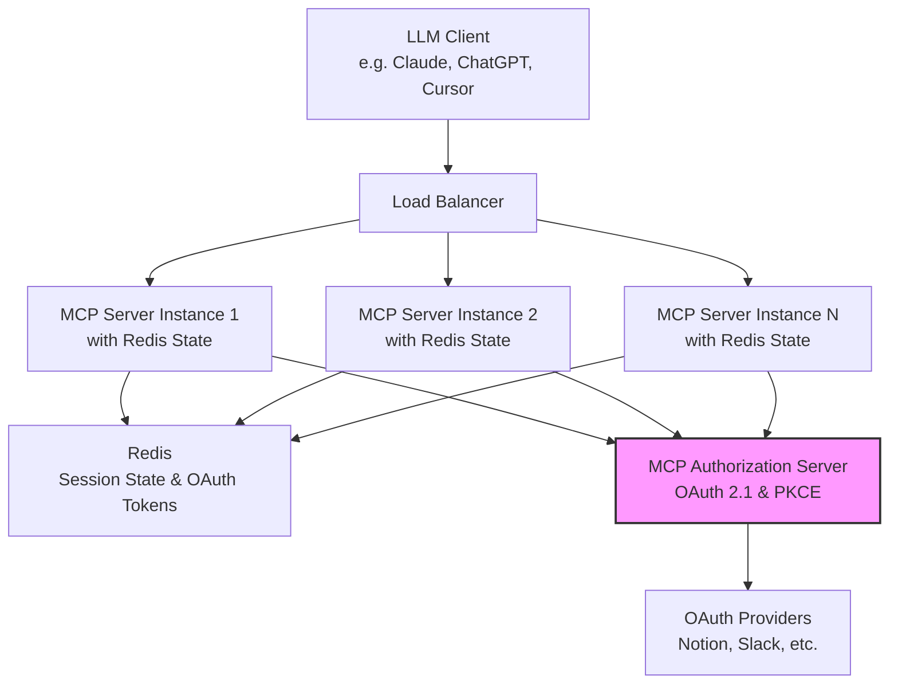

# MCPToolKit - Production-Ready MCP Server Framework

## The Problems We Solve

### 1. Scaling MCP Servers in Production
The standard FastMCP framework faces significant challenges in production environments:
- **State Management**: Traditional FastMCP servers maintain state in memory, making horizontal scaling difficult
- **Serverless Limitations**: Serverless environments require stateless architectures, which FastMCP wasn't designed for
- **Multi-tenant Support**: Running multiple tenants on the same server requires complex session management

### 2. Delegated OAuth Support
Managing authentication for MCP servers is complex:
- **Tool-Level Auth**: Users should only authenticate when a tool requires it
- **Third-Party Integration**: Supporting OAuth for services like Notion, Slack, etc. requires complex token management
- **Security**: Managing multiple authentication flows while maintaining security is challenging

## Our Solution

MCPToolKit provides a production-ready framework that solves these problems while maintaining full compatibility with FastMCP. Here's how it works:



This architecture diagram illustrates how MCPToolKit enables production-ready MCP servers:

1. **LLM Clients** (e.g., Claude, ChatGPT, Cursor) initiate requests to the MCP server. These clients can be any application that needs to interact with MCP tools.

2. **Load Balancer** distributes incoming requests across multiple MCP server instances, enabling horizontal scaling and high availability.

3. **MCP Server Instances** (1 through N) handle tool execution and resource access. Each instance:
   - Maintains its own Redis state for session persistence
   - Can handle requests independently
   - Shares the same codebase and configuration
   - Can be scaled horizontally based on demand

4. **Redis** serves as the central state store, providing:
   - Session state persistence across server restarts
   - OAuth token storage and management
   - Shared state between server instances
   - Enables stateless server instances

5. **MCP Authorization Server** (highlighted in pink) manages all OAuth-related operations:
   - Implements OAuth 2.1 with PKCE for secure authentication
   - Handles token issuance and refresh
   - Manages consent flows
   - Centralizes OAuth logic for all server instances

6. **OAuth Providers** (e.g., Notion, Slack) are the third-party services that users can authenticate with. The authorization server manages these connections securely.

This architecture enables:
- True horizontal scaling through stateless server instances
- Centralized OAuth management
- High availability through multiple server instances
- Secure token management
- Consistent user experience across sessions

## Migration from FastMCP

Migrating from FastMCP to MCPToolKit is straightforward. Here's how to update your existing FastMCP server:

```diff
# Before (FastMCP)
- from mcp.server.fastmcp import FastMCP
- 
- # Create an MCP server
- mcp = FastMCP("Demo")

# After (MCPToolKit)
+ from mcptoolkit import MCPToolKit
+ import os
+ 
+ # Create a production-ready MCP server
+ mcp = MCPToolKit(
+     name="Demo",
+     redis_url=os.environ.get("REDIS_URL", "redis://localhost:6379/0")
+ )

# Your tools and resources remain exactly the same
@mcp.tool()
def add(a: int, b: int) -> int:
    """Add two numbers"""
    return a + b

@mcp.resource("greeting://{name}")
def get_greeting(name: str) -> str:
    """Get a personalized greeting"""
    return f"Hello, {name}!"
```

The migration requires just a few simple changes:
1. Change the import statement
2. Add Redis URL configuration
3. That's it! All your existing tools, resources, and prompts continue to work exactly as before

For serverless deployments, you'll also need to update your deployment configuration:

```diff
# Before (FastMCP)
- # api/index.py
- from mcp.server.fastmcp import FastMCP
- 
- mcp = FastMCP("Demo")
- app = mcp.create_fastapi_app()

# After (MCPToolKit)
+ # api/index.py
+ from mcptoolkit.vercel import create_vercel_app
+ import os
+ 
+ app = create_vercel_app(
+     name="Demo",
+     redis_url=os.environ.get("REDIS_URL")
+ )
```

Key Features:
- **Redis-Backed State**: Session state persists across server restarts and function invocations
- **Serverless Ready**: Designed for Vercel, AWS Lambda, and other serverless platforms
- **Horizontal Scaling**: State persistence enables true horizontal scaling
- **Multi-tenant Support**: Multiple users can connect to the same endpoint with isolated sessions

### 2. Delegated OAuth Support
```python
from mcptoolkit import MCPToolKit, requires_auth
from mcptoolkit.auth.providers import NotionProvider, SlackProvider

# Define default scopes for each provider
default_notion_scopes = [
    "read:database",
    "write:page",
    "read:page"
]

default_slack_scopes = [
    "channels:read",
    "chat:write",
    "reactions:write"
]

server = MCPToolKit(name="Auth Server")

@server.tool()
@requires_auth(provider=NotionProvider(
    scopes=default_notion_scopes,
    consent_required=True  # Require explicit user consent
))
def notion_search(query: str, ctx: Context) -> str:
    # Access authenticated Notion client with specific scopes
    notion = ctx.get_oauth_client("notion")
    return notion.search(query)

@server.tool()
@requires_auth(provider=SlackProvider(
    scopes=default_slack_scopes,
    consent_required=True
))
def slack_message(channel: str, message: str, ctx: Context) -> str:
    # Access authenticated Slack client with specific scopes
    slack = ctx.get_oauth_client("slack")
    return slack.post_message(channel, message)
```

Key Features:
- **Lazy Authentication**: Users only authenticate when a tool requires it
- **Provider Support**: Built-in support for common providers (Notion, Slack, etc.)
- **Token Management**: Automatic token refresh and storage
- **Security**: Secure token storage and transmission
- **Granular Scopes**: Fine-grained control over OAuth permissions
- **Consent Management**: User-friendly consent screens with logical permission groupings
- **Human-in-the-Loop**: Optional approval requirements for high-risk actions

### OAuth Flow
MCPToolKit implements a secure OAuth 2.1 flow with PKCE:

1. LLM Client initiates a request to an MCP server
2. Server responds with a 401 Unauthorized and redirect link
3. User logs in to the OAuth provider and grants requested scopes
4. Server returns an auth code to the client
5. Client exchanges the code for access + refresh tokens
6. Tokens are used for subsequent requests
7. MCP server calls the third-party service

### Authorization Server Architecture
MCPToolKit supports two deployment models for the authorization server:

1. **Embedded Authorization Server**
   - MCP server acts as both Identity Provider and Relying Party
   - Handles login, consent, and token issuance directly
   - Manages token lifetimes, refresh logic, and revocation
   - Best for standalone applications

2. **External Authorization Server**
   - MCP server acts as a Relying Party
   - Delegates OAuth flow to external services (e.g., Stytch)
   - Focuses on tool-level access control
   - Best for integrating with existing identity infrastructure

Both models support:
- OAuth 2.1 with PKCE
- Dynamic Client Registration
- Authorization Server Metadata (RFC 8414)
- Custom scopes based on Resources/Actions
- End user consent management
- Granular scope definitions per provider
- Organization-level visibility and control
- Implied permissions (users can only grant permissions they have)

### Consent and Access Management
MCPToolKit provides comprehensive consent and access management:

- **Organization-Level Visibility**: View all connected apps authorized across your organization
- **Granular Permissions**: See which members have granted access and which scopes they've authorized
- **Access Management**: Revoke access for specific users or apps at any time
- **User-Friendly Consent**: Present RBAC permissions in logical groupings
- **Implied Permissions**: Users can only give an app the same permissions they have
- **Human-in-the-Loop**: Require human approval for high-risk actions

### High-Risk Action Protection
```python
@server.tool()
@requires_auth(provider=NotionProvider(
    scopes=["delete:database"],
    human_approval_required=True  # Require explicit human approval
))
def delete_database(database_id: str, ctx: Context) -> str:
    # This action will require explicit human approval
    notion = ctx.get_oauth_client("notion")
    return notion.delete_database(database_id)
```

## Architecture

### Deployment Options

#### Kubernetes
```yaml
apiVersion: apps/v1
kind: Deployment
metadata:
  name: mcp-server
spec:
  replicas: 3
  template:
    spec:
      containers:
      - name: mcp-server
        image: your-mcp-server
        env:
        - name: REDIS_URL
          valueFrom:
            secretKeyRef:
              name: redis-credentials
              key: url
```

#### Serverless (Vercel)
```python
# api/index.py
from mcptoolkit.vercel import create_vercel_app

app = create_vercel_app(
    name="Serverless MCP",
    redis_url=os.environ.get("REDIS_URL")
)
```

## Quick Start

1. Install MCPToolKit:
```bash
pip install mcp-python-sdk
```

2. Create your server:
```python
from mcptoolkit import MCPToolKit, requires_auth

server = MCPToolKit(
    name="My Production Server",
    redis_url="redis://localhost:6379/0"
)

@server.tool()
def public_tool() -> str:
    return "This tool doesn't require auth"

@server.tool()
@requires_auth(provider="notion")
def notion_tool() -> str:
    return "This tool requires Notion auth"
```

3. Deploy to your preferred platform (Kubernetes, Vercel, etc.)

## Requirements

- Python 3.9+
- Redis instance (for session state persistence)
- OAuth provider credentials (if using delegated auth)

## License

Same as the MCP Python SDK.